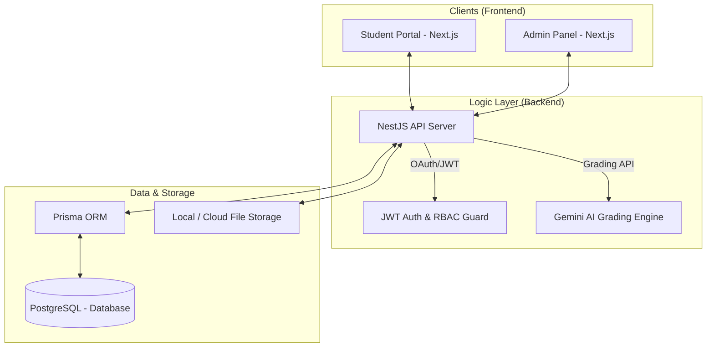
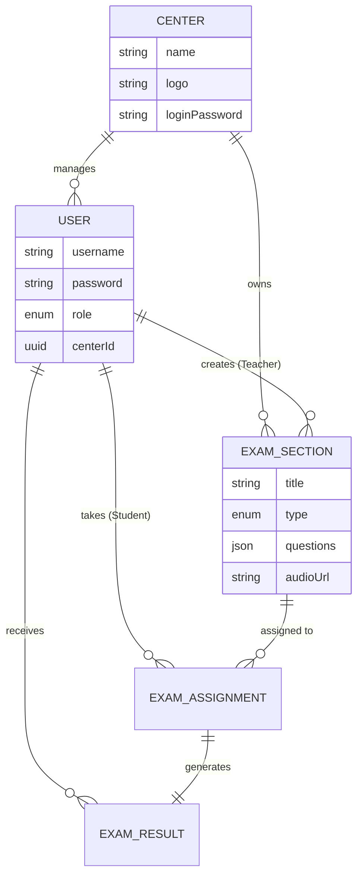
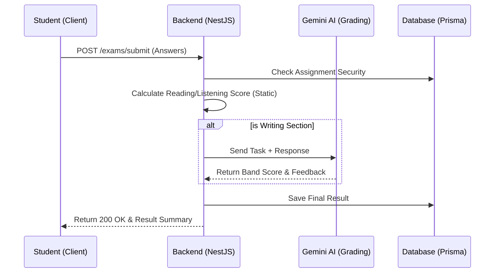

# IELTS Mock Exam Platform - Features & Roadmap

This document outlines the current state of the platform, recommendations for full production readiness, and potential technical and UX improvements.

## 🚀 Current Features

### 1. Admin Panel (SuperAdmin, CenterAdmin, Teacher)

- **Role-Based Access Control (RBAC):** Distinct permissions for SuperAdmins (global), CenterAdmins (center-specific), and Teachers.
- **Center Management:** Complete Lifecycle for Learning Centers including custom logos and center-specific login passwords.
- **User Management:** Onboarding students and staff with automatic center association.
- **Exam Builder:** Advanced interface to create Listening, Reading, and Writing sections with support for images, audio, and complex instruction formatting.
- **Dashboard Analytics:** High-level view of total users, active exams, and recent platform activity.
- **Theme Engine:** Full Light/Dark/System mode support across the entire admin suite.
- **PDF Generation:** Automated generation of student result reports.

### 2. Student Portal

- **Exam Environment:** "Computer-Delivered IELTS" clone interface with side-by-side resizable panels.
- **Anti-Cheat System:** Tab-switch detection and browser activity monitoring.
- **Interactive Tools:** Text highlighting, strike-through, and persistent timer.
- **Rich Question Support:** Supports all standard IELTS types including Multiple Choice, Matching, True/False/Not Given, Form/Note Completion, and Diagram Labeling.
- **Writing Interface:** Real-time word count tracking and professional text area for tasks.

### 3. Backend & Intelligence

- **NestJS Architecture:** Scalable, modular backend with Prisma ORM.
- **AI Auto-Grading:** Integrated with Gemini AI for intelligent Writing task evaluation (Grammar, Coherence, Lexical Resource).
- **Automatic Scoring:** Instant marking for Reading and Listening based on exact/flexible match logic.
- **File Management:** Robust upload system for exam assets (audio/images).

---

## 🛠 Features Needed for "Full Production Ready"

### 1. Speaking Section (Major Missing Piece)

- **Audio Recording:** Browser-based recording for Task 1, 2, and 3.
- **Real-time Evaluation:** Integration with AI Speech-to-Text to analyze fluency, pronunciation, and vocabulary.
- **P2P Speaking:** Optional WebRTC integration for live Teacher-to-Student speaking interviews.

### 2. Standardized Band Score Calculation

- **Conversion Tables:** Implement the official IELTS 0-40 to 0.0-9.0 band score conversion table for Reading (Academic vs General) and Listening.
- **Writing Band Descriptor Logic:** Refine AI prompts to strictly follow official public band descriptors.

### 3. Full Mock "Bundles"

- **Session Linking:** Allow admins to create a "Full Mock" which links 4 sections together in a specific sequence (L -> R -> W -> S).
- **Inter-section Breaks:** Implement mandatory 2-minute breaks or automatic transitions between sections.

### 4. Advanced Proctoring

- **Webcam Monitoring:** Random snapshots during the exam to verify student identity.
- **Full-Screen Force:** Lock the browser into full-screen mode and prevent exit until submission.

### 5. Multi-Center Billing

- **Subscription Management:** Stripe/Payme/Click integration for centers to pay for student slots.
- **Invoicing:** Automatic invoice generation for center administrators.

---

## 📈 Suggested Improvements

### User Experience (UX)

- **Note-Taking:** Add a "Notes" button to every question where students can jot down thoughts without leaving the page.
- **Highlighting Context Menu:** Allow students to right-click text to "Highlight" or "Clear Highlight," mimicking the real IELTS software.
- **Keyboard Shortcuts:** Support `Alt+H` for highlight and `Alt+N` for notes.
- **Review Screen:** A final summary page before submission showing which questions were skipped or flagged.

### Technical Performance

- **Cloud Storage:** Migrate from local `/uploads` to AWS S3 or Google Cloud Storage for better scaling and CDN delivery of audio files.
- **WebSocket Integration:** Use Socket.io for real-time monitoring. Teachers should see a "Live View" of students current progress (e.g., "Student X is on Question 15").
- **Offline Resilience:** Implement local storage sync so if a student's internet drops, their answers aren't lost.
- **Mobile Admin:** Optimize the Admin Panel for mobile devices (currently it heavily favors desktop views).
- **Performance Caching:** Implement Redis for frequently accessed exam data to reduce database load during high-traffic mock days.

### Educational Tools

- **Deep Analytics:** Provide students with "Error Categorization" (e.g., "You frequently fail at True/False/Not Given questions").
- **Teacher Feedback Loop:** A dedicated UI for Teachers to highlight specific parts of a student's Writing response and add "Sticker" comments.

---

## � Project Visualization & Architecture Schema

### 1. High-Level System Architecture

### 2. Database Entity Relationship (ER) Schema

### 3. Exam Submission Flow

---

## 🏗 System Design Deep Dive

### 1. Unified Authentication Protocol (UAP)

- **Mechanism:** Stateless JWT (JSON Web Tokens) with a 24h expiration.
- **Payload:** Contains `userId`, `role`, and `centerId`.
- **Security:** Passport.js strategies implemented at the NestJS level ensure that students can never access Admin endpoints, and Center-level isolation prevents Teachers in Center A from seeing exams in Center B.

### 2. Intelligent Auto-Grading Pipeline

- **Sync/Async Hybrid:** Reading and Listening are graded **synchronously** via regex and exact-match logic.
- **AI Orchestration:** Writing tasks are processed via **Gemini 1.5 Flash**. The system uses a "System Prompting" strategy to inject IELTS Band Descriptors into the AI context, ensuring objectivity.
- **Retry Logic:** Implemented to handle Gemini API rate limits or transient failures during high-concurrency exam sessions.

### 3. Frontend Architecture (Atomic & Modular)

- **UI Framework:** Next.js with Tailwind CSS v4.
- **State Management:** React Context (Auth, Theme, Settings) combined with local component state for exam interactions.
- **Anti-Cheat Layer:** Event listeners for `visibilitychange` (tab switching) and `blur` (window focus loss) that log violations to the backend in real-time.

### 4. Search and Retrieval

- **Full-Text Search:** Currently handled by PostgreSQL `ILIKE` operators for student/exam lookups.
- **Scalability Note:** Future migrations involve **Lucene** or **ElasticSearch** if the dataset grows into millions of questions.

### 5. Multi-Tenant Data Isolation

- **Strategy:** Logical isolation via `centerId` foreign keys on all core entities (User, ExamSection, Result).
- **Admin Visibility:** SuperAdmins have a "Null-Center" status that bypasses the isolation layer via global decorators.

---

## �🛑 Developer Mistakes, Technical Debt & "Architectural Sin"

This section highlights critical flaws observed in the current project state that will lead to catastrophic failures at scale.

### 1. The "Big Ball of Mud" (God Components)

- **Mistake:** `frontend/src/app/exam/[id]/page.tsx` is +1200 lines long. It handles everything: state, timers, video, navigation, API calls, and logic for Listening, Reading, and Writing.
- **Problem:** Violates the **Single Responsibility Principle**. It is a nightmare to test or debug. A change in Listening logic can accidentally break the Writing section.
- **Review:** Grade: **D**. Refactor immediately. Move section-specific logic into dedicated `ExamRunner` components and use custom hooks or a State Machine (XState) to manage the exam lifecycle.

### 2. Scalability Suicide (Local File Storage)

- **Mistake:** Audio and images are stored locally in the backend's `/uploads` folder.
- **Problem:** This makes the application **Stateful**. You cannot deploy this to a modern cluster, use a Load Balancer, or scale horizontally across multiple instances without losing access to files.
- **Review:** Grade: **F**. Production-grade apps use **S3 Object Storage** (AWS S3, MinIO, etc.) to ensure assets are globally available and persistent.

### 3. Type Safety Shadows (`any` & Weak Typing)

- **Mistake:** Heavy reliance on casting JSON types in Prisma as `any` or `Prisma.JsonValue`.
- **Problem:** TypeScript is being used as a "suggestion" rather than a rule. You've traded core database safety for the "freedom" of JSON without implementing runtime schemas.
- **Review:** Grade: **C-**. Use **Zod** or **Valibot** to validate database JSON outputs at the service layer to ensure the UI doesn't crash on "Cannot read property 'X' of undefined".

### 4. Database Bottleneck (Missing Strategic Indexing)

- **Mistake:** Lack of composite indexes on frequently filtered fields like `(centerId, role, createdAt)`.
- **Problem:** As your student database grows from 100 to 100,000, your Admin Dashboard will transition from "Fast" to "Frozen" due to sequential table scans.
- **Review:** SQL optimization is omitted in the current schema. Index your Foreign Keys and filter criteria.

### 5. Deployment Danger (Migrate vs Deploy)

- **Mistake:** Using `prisma migrate dev` in non-development environments.
- **Problem:** `migrate dev` is designed for prototyping and can be destructive.
- **Review:** Use `prisma migrate deploy` in production pipelines to ensure schema updates are applied safely without data loss.

### 6. The "Silent Killer" (Missing Error Boundaries)

- **Mistake:** Most pages lack React Error Boundaries.
- **Problem:** A single failed component (e.g., a broken image or a null reference in one question) will turn the entire 3-hour exam screen white for a student.
- **Review:** High-stakes exam platforms must be resilient. Wrap major sections in Error Boundaries that allow "Graceful Recovery" or "Safe State Resumption".

### 7. Client-Side Security Illusion

- **Mistake:** Relying solely on client-side hooks (`useAntiCheat`) for security.
- **Problem:** A student can disable these hooks via the browser console in seconds.
- **Review:** Anti-cheat must include **Server-Side Validation** (e.g., checking if the time taken to answer 40 questions is humanly possible, or if the student submitted answers from an unauthorized IP).
